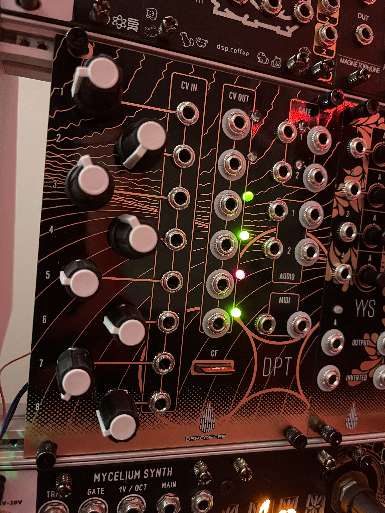

# dsp.coffee dpt - multifunction electron temple

**NOTE: This is an early commit, example firmware to follow.
This is primarily an internal project, a limited supply of boards+panels is available.**

electrosmith daisy patch submodule based development platform

* 8 pots normalled to +5V.
* 8 CV in, this breaks normalled connection and pot acts as an attenuator.
* 2 gate in
* 2 gate out
* High fidelity stereo in/out (Daisy Patch Submodule uses the PCM3080 codec).
* 2 12-bit CV out from Daisy Patch Submodule, scaled to -5v to 10v
* 4 12-bit CV (or lofi audio w/ some hacking) from external DAC7554, scaled to -7v to 7v.
* TRS MIDI in/out (midi in uses lpzw auto-sensing circuit for type a/b)
* SD card slot.
* Expander header on the back for +5v, +3v3, SPI, UART, I2C, and USB connections.

Output scaling circuits for DAC7554 and TRS MIDI are based
on portions of https://github.com/plinkysynth/plinky-expander

Additional References
* https://www.electro-smith.com/daisy/patch-sm
* https://electro-smith.github.io/DaisySP/index.html
* https://electro-smith.github.io/libDaisy/index.html

Thx
* https://github.com/makingsoundmachines
* https://github.com/thisisnotrocketscience
* https://github.com/mmalex

BOM

|Designator|Package                                                                                                                                                                                                                 |Quantity                                   |Designation|Supplier and ref      |
|----------|------------------------------------------------------------------------------------------------------------------------------------------------------------------------------------------------------------------------|-------------------------------------------|-----------|----------------------|
|LED3,LED4 |3mm LED                                                                                                                                                                                                                 |2                                          ||                      |
|J*|Mono Thonkiconn                                                                                                                                                                                                         |24                                         |                     |
|VRCV*|9mm Potentiometer (Alpha / Alps)                                                                                                                                                                                        |8                                          |10K        |                      |
|D4,D6,D5,D3,D8,D7|3mm LED (Bipolar Red / Green)                                                                                                                                                                                           |6                                          |LED_Dual_Bidirectional|Tayda                 |
|U_SDCARD1 |VERT_MICROSD_CENTERED                                                                                                                                                                                                   |1                                          || Mouser 945-PJS008U-3000-0 / Thonk |
|U9        |Electrosmith Daisy Patch Submodule                                                                                                                                                                                      |1                                          |ES_DAISY_PATCH_SM_REV1|                      | https://www.electro-smith.com/daisy/patch-sm
|R36,R35,R18,R16,
R17,R19|0603                                                                                                                                                                                                       |6                                          |1k         |                      |
|U11,U5,U10,U3,
U6,U4|SOIC-8                                                                                                                                                                                            |6                                          |TL072      |                      |
|C5,C4     |0603                                                                                                                                                                          |2                                          |100n       |                      |
|R9,R11,R10,R8|0603                                                                                                                                                                                                   |4                                          |56k        |                      |
|C2,C3     |C_Elec_4x5.4                                                                                                                                                                                                            |2                                          |47u        |                      |
|J_I2C1    |2x03 2.54mm_Vertical                                                                                                                                                                                         |1                                          ||                      |
|C11,C12,C13,C10,C18,C17|0603                                                                                                                                                                                                      |6                                          |1n         |                      |
|R22,R4,R7,R20,R29,
R30,R2,R6,R5|0603                                                                                                                                                                                                     |9                                          |10k        |                      |
|C14,C16,C6,C7,
C1,C8,C15,C9|0603                                                                                                                                                                                                     |8                                          |100n       |                      |
|R26,R34,R15,R24,
R33,R28,R27,R14,
R13,R25,R12|0603                                                                                                                                                                                                      |11                                         |220R       |                      |
|J14       |2x05 P2.54mm Vertical                                                                                                                                                                                         |1                                          ||                      |
|U2        |DAC7554IDGS                                                                                                                                                                                                  |1                                          ||                      |
|R32,R31   |0603                                                                                                                                                                                                      |2                                          |30k        |                      |
|R23,R21   |0603                                                                                                                                                                                                      |2                                          |4.7k       |                      |
|U8        |HCPL-0631 SOIC-8                                                                                                                                                                                               |1                                          |  |                      |
|U1        |LM4040DBZ-2.5 SOT-23                                                                                                                                                                                                                  |1                                          ||                      |
|J_EXPANDER2|2x08 P2.54mm Vertical                                                                                                                                                                                         |1                                          |USB_SPI_MUX_EXPANDER|                      |
|R1        |0603                                                                                                                                                                                                      |1                                          |3k         |                      |
|D2,D1     |1N1517 SOD-323                                                                                                                                                                                                               |2                                          |     |                      |
|R3        |0603                                                                                                                                                                                                      |1                                          |7.5k       |                      |
|U7        |SN74LVC1G17DBV SOT-23-5                                                                                                                                                                                                                |1                                          ||                      |

